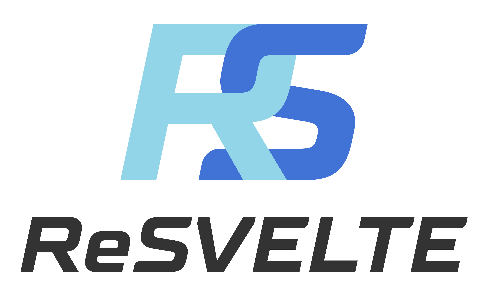
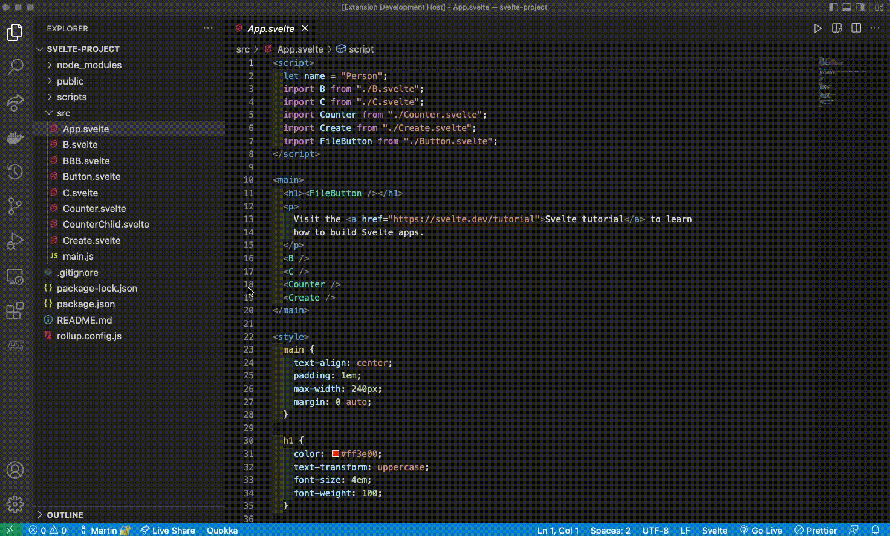
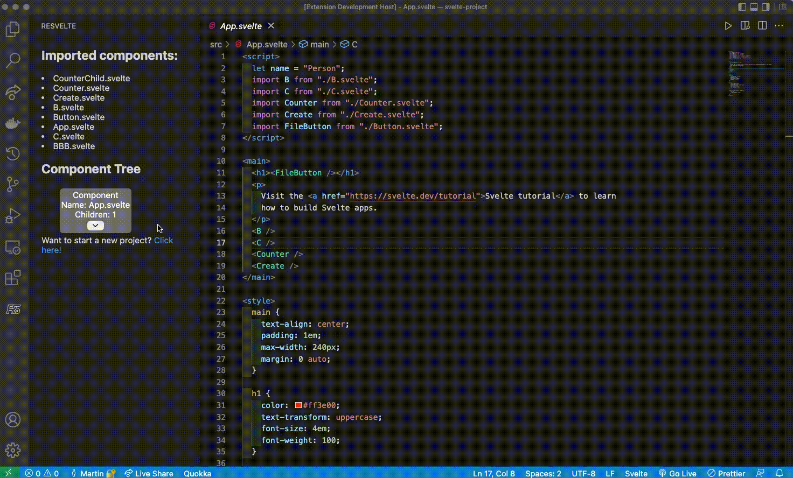

  

  <h1>ReSvelte</h1>
  A Svelte component tree visualizer and metrics display tool

  <a href='https://github.com/oslabs-beta/ReSvelte/issues'>Report Issues</a>
  
  <a href='https://github.com/oslabs-beta/ReSvelte/issues'>Request a Feature</a>

# About ReSvelte

As developers create Svelte applications, the component tree increasingly scales in size. Components are a delicate part of front end frameworks. Efficiently placing and correctly executing components are of high importance.

Having more components re-rendering, will affect the general performance of the application.

ReSvelte solves this issue. It is a performance developer tool that generates a Svelte component tree visualizer and a component rendering metrics display of your Svelte application within a Visual Studio Code extension. 

# Getting Started with Installation and Usage

1. If not already installed, install Visual Studio Code for your respective operating system. <a href='https://code.visualstudio.com/download'>Download Visual Studio Code</a>

2. Search for ReSvelte in the Visual Studio Code Extension MarketPlace and install. 

3. A ReSvelte icon should appear on your sidebar. You have successfully installed ReSvelte! 

4. Upload your Svelte folder. If there is an error, you will see an error message.  

5. The component tree visualizer should now be populated in the sidebar with the component name. Toggle through the down arrows to expand the tree. 

6. Underneath the tree, the app performance shows the total number of components rendered in your application and the number of components that can re-render.

## Built With

  <li>
    
    React with React Hooks
  </li>
  <li>
    
    Visual Studio Code Extension API
  </li>
  <li>
    
    Typescript
  </li>
  <li>
    
    Svelte
  </li>
  <li>Svelte-Parse</li>
  <li>
    
    WebView
  </li>
  <li>
    
    Webpack</li>
  <li>
    
    SCSS/SASS
  </li>

# Getting Started as a Contributor

1. Clone ReSvelte from GitHub

2. Open the ReSvelte folder in your VS Code IDE. 

3. Run the command: `npm install`

4. Run the command: `npm run watch`

5. Press F5. Click "Debug Anyways". This will open the development extension to allow debugging and view the ReSvelte extension. 

6. Click the 'RS' ReSvelte extension button on the left panel

7. Proceed to upload a Svelte folder 

8. Press `command, shift, P` then type into the search bar "Developer: Open Webview Tools" to see the dev tools panel

9. If you make a change to the code, press the green restart button on the original code editor debugging bar. This will restart the development extension. Then repeat step 7.

## What to Contribute

ReSvelte is an open source tool. Contributions are what make the open source community such an amazing place to learn, inspire, create, and grow. Any contributions you make are greatly appreciated. Here are some features that could improve this application and build upon the core functionality:

<li>Store the paths of all files which would allow the user to click on a component and be taken to that file for further editing or confirmation</li>
<li>Adding render time to the performance metrics</li>
<li>Tracking memory usage of an imported application</li>
<li>Add a link in the component tree to show the hierarchy</li>
<li>Automatically find components in the imported application that aren’t running as expected and draw the user to that area</li>
<li>A time machine that will allow users to make changes without risking the current state of the application</li>
<li>Live updating of extension</li>

We would love to hear your technical feedback! If you have suggestions, simply open an issue with the tag "enhancement". 

Don't forget to give this developer tool a star. Thank you for your contribution!

# License
Distributed under the MIT License. See `LICENSE` for more information

# Contributors

  <li> 
    Hoon Park 
    <a href="https://www.linkedin.com/in/hoonpvrk">LinkedIn</a> 
    
    <a href="https://github.com/hoonpvrk">GitHub</a>
  </li>
  <li> 
    Martin Ng 
    <a href="https://www.linkedin.com/in/martinngsf/">LinkedIn</a> 
    
    <a href="https://github.com/kamartinng">GitHub</a>
  </li>
  <li>
    Jestyn Apuya 
    <a href="https://www.linkedin.com/in/jestynapuya/">LinkedIn</a> 
    
    <a href="https://github.com/JestynA">GitHub</a>
  </li>
  <li>
    Steven Nguyen 
    <a href="https://www.linkedin.com/in/nguyennsteven">LinkedIn</a> 
     
    <a href="https://github.com/Sateeven">GitHub</a>
  </li>
  <li>
    Candie Hill 
    <a href="https://www.linkedin.com/in/candie-hill/">LinkedIn</a> 
    
    <a href="https://github.com/can619">GitHub</a>
  </li>

# Contact Us

Email: resvelteadm@gmail.com 

Website: http://resvelte.com/

