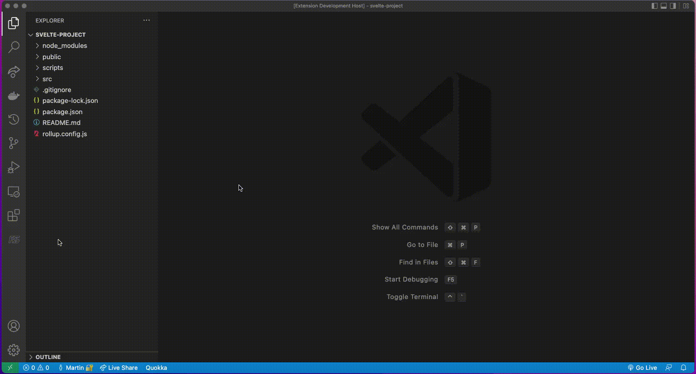

  
  

# ReSvelte README

Welcome to ReSvelte, a VS Code extension performance developer tool that generates a Svelte component tree visualizer and a component rendering metrics display. 

## Features

<!-- Describe specific features of your extension including screenshots of your extension in action. Image paths are relative to this README file. -->
How to install from VSCode Marketplace

Importing a Svelte file into the extension

Opening and closing the component tree visualizer

Viewing the Performance display
<!-- For example if there is an image subfolder under your extension project workspace: -->

<!-- \!\[feature X\]\(images/feature-x.png\) -->

<!-- > Tip: Many popular extensions utilize animations. This is an excellent way to show off your extension! We recommend short, focused animations that are easy to follow. -->

## Installation

1. Search for ReSvelte in the VSCode Extension MarketPlace and install. 

2. A ReSvelte icon should appear on your sidebar. You have successfully installed ReSvelte! 

3. Upload your Svelte folder. If there is an error, you will see an error message.  

4. Tree Visualizer should now be populated in the sidebar
<!-- If you have any requirements or dependencies, add a section describing those and how to install and configure them. -->

<!-- To get started, execute "npm i" in your terminal -->
<!-- Execute 'npm run build' in the terminal to get the application started -->
<!-- 'npm install' to install all the dependencies -->
## Technologies Used 

React, Typescript, Svelte, React Hooks

## What Needs Work?

None so far!
ReSvelte will be updated as needed.

## Developers

* Hoon Park <a src"https://www.linkedin.com/in/hoonpvrk">Linkedin</a> <a src"https://github.com/hoonpvrk">Github</a>
* Martin Ng <a src"http://www.linkedin.com/in/nguyennsteven">Linkedin</a> <a src"https://github.com/Sateeven">Github</a>
* Jestyn Apuya <a src"https://www.linkedin.com/in/jestynapuya/">Linkedin</a> <a src"https://github.com/JestynA">Github</a>
* Steven Nguyen <a src"https://www.linkedin.com/in/nguyennsteven">Linkedin</a> <a src"https://github.com/Sateeven">Github</a>
* Candie Hill <a src"https://www.linkedin.com/in/candie-hill/">Linkedin</a> <a src"https://github.com/can619">Github</a>
* Kristina Wallen <a src"https://www.linkedin.com/in/kristina-wallen/">Linkedin</a> <a src"https://github.com/kristinawallen">Github</a>

## Contact Us
Email: resvelteadm@gmail.com

Website: resvelte.com

// END READ ME
-----------------------------------------------------------------------------------------------------------
## Following extension guidelines

Ensure that you've read through the extensions guidelines and follow the best practices for creating your extension.

* [Extension Guidelines](https://code.visualstudio.com/api/references/extension-guidelines)

## Working with Markdown

**Note:** You can author your README using Visual Studio Code.  Here are some useful editor keyboard shortcuts:

* Split the editor (`Cmd+\` on macOS or `Ctrl+\` on Windows and Linux)
* Toggle preview (`Shift+CMD+V` on macOS or `Shift+Ctrl+V` on Windows and Linux)
* Press `Ctrl+Space` (Windows, Linux) or `Cmd+Space` (macOS) to see a list of Markdown snippets

### For more information

* [Visual Studio Code's Markdown Support](http://code.visualstudio.com/docs/languages/markdown)
* [Markdown Syntax Reference](https://help.github.com/articles/markdown-basics/)

